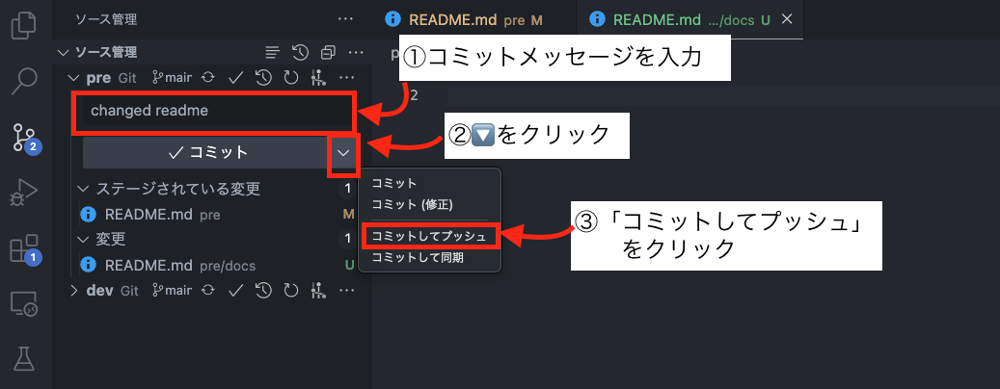

# ファイルを編集しコミットし、GitHubに反映させる。
前 → [ブランチの作成・移動](./01.md)

ここでは、前項で作成した作業用ブランチでファイルを編集し、コミットします。

そして、自身の作業内容をGitHubにあげます。

## 作業内容
1. VS Codeなどのエディタで`docs/handson/index.html`を編集し、「**藤原有希**」となっている箇所を自身の名前に書き換えてください。
2. 変更をコミットしてください。このとき、適切にコミットメッセージをつけてください。
3. ブランチをpushしてGitHubに反映させてください。

## コマンド例
```bash
#2-1 ファイルをステージングエリアに登録
$ git add .

#2-2 ステージングエリアに登録された変更内容をコミット
$ git commit -m '著者名を「山田太郎」に変更した'

#3 pushしてGitHubにあげる
$ git push origin feature-fujiwara
```

## VS Code からGUIでのコミット方法
2-1 ファイルをステージングエリアに登録


2-2, 3 コミットとpush


次 → [プルリクエストを作成する](./03.md)
