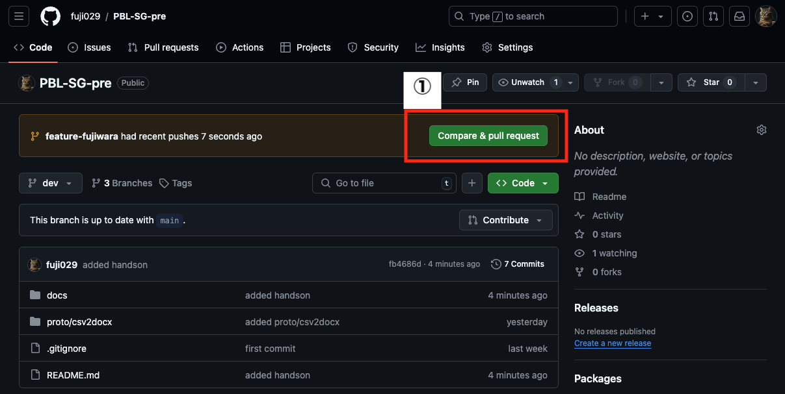
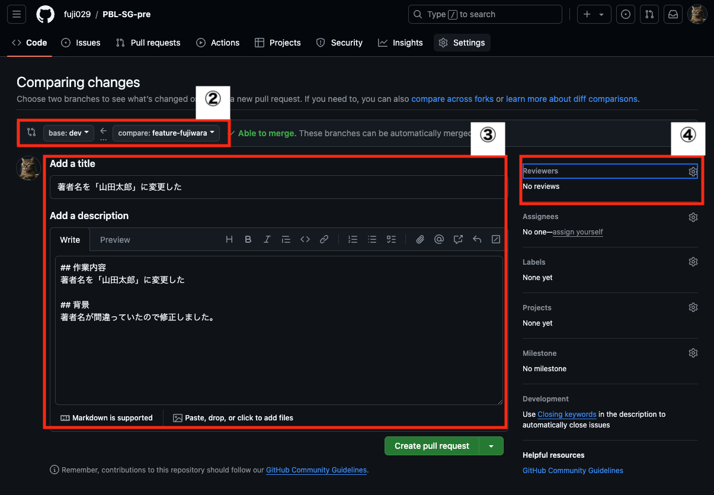

# プルリクエストを作成する
前 → [ファイルを編集しコミットし、GitHubに反映させる。](./02.md)

ここではGitHubにあげたブランチを元の`dev`ブランチに統合(merge)するために、**プルリクエスト**を作成します。

## 作業内容
1. `dev`ブランチへのプルリクエストの作成を開始してください。
2. ベースブランチとトピックブランチを選択してください。
3. プルリクエストの「タイトル」と「コメント」を記入してください。
4. レビュアーを指定してください。
5. 班長からのコメントを待ってください。

### 1. プルリクエストの作成
pullした後でGitHubのリポジトリにアクセスすると、以下の画面が表示される。

この画面の赤枠①をクリックすると、プルリクエストを作成できる。

### 2. ブランチの選択
プルリクエストの作成画面は以下である。

赤枠②の**左**が「**マージ先**」のブランチ名で、右が「マージ元」のブランチ名である。
今回は、`feature-fujiwara`を`dev`にマージする。
🚨注意！マージ先が`main`など他のブランチになっていないかよく確認する。

### 3. プルリクエストの記載
赤枠③にタイトルと説明を記載する

### 4. レビュアーの指定
赤枠④をクリックし、レビュアーとして班長を設定する。
